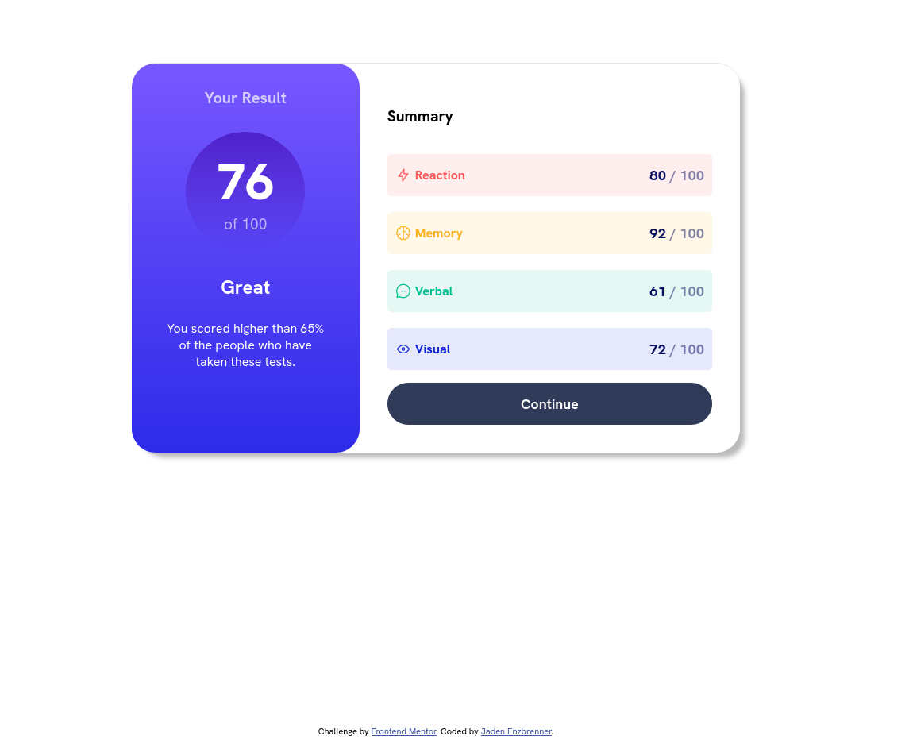

# Frontend Mentor - Results summary component solution

This is a solution to the [Results summary component challenge on Frontend Mentor](https://www.frontendmentor.io/challenges/results-summary-component-CE_K6s0maV). Frontend Mentor challenges help you improve your coding skills by building realistic projects.

## Table of contents

- [Overview](#overview)
  - [The challenge](#the-challenge)
  - [Screenshot](#screenshot)
  - [Links](#links)
- [My process](#my-process)
  - [Built with](#built-with)
  - [What I learned](#what-i-learned)
- [Author](#author)

**Note: Delete this note and update the table of contents based on what sections you keep.**

## Overview

### The challenge

Users should be able to:

- View the optimal layout for the interface depending on their device's screen size
- See hover and focus states for all interactive elements on the page
- **Bonus**: Use the local JSON data to dynamically populate the content

### Screenshot

### Links

- Solution URL: [https://github.com/jadenenz/blog-preview-card](https://github.com/jadenenz/blog-preview-card)
- Live Site URL: [https://lighthearted-quokka-d3f5d3.netlify.app/](https://lighthearted-quokka-d3f5d3.netlify.app/)

## My process

### Built with

- Semantic HTML5 markup
- CSS custom properties
- Flexbox
- Mobile-first workflow
- Sass

### What I learned

This challenge helped me reinforce and get more comfortable using gradients, as well as adding more basic practice laying out various elements exactly how I want them.

I learned a bit about hsla application in order to emphasize and deemphasize certain UI elements for better UX.

I also used Sass for the first time on this project, and while my code didn't end up deviating from standard CSS very much at all, I did gain an understanding of what Sass is about and was able to touch on some of the special features associated with it in this project.

## Author

- Website - [Jaden Enzbrenner](https://www.your-site.com)
